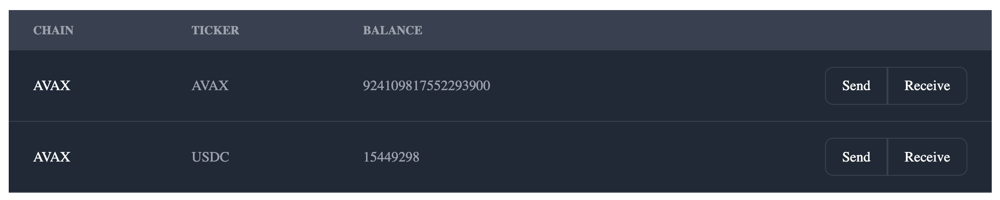

# Crypto Manager Dashboard
This project is a simple dashboard to manage cryptocurrencies using React and Tailwind CSS. The app shows balances of different blockchains and provides functionalities to send and receive funds.

## Features
Display balances of different blockchains.
Send funds via a form modal.
Receive funds by copying the address to the clipboard through a modal.
## Screenshots
### Main Dashboard


### Receive Modal


### Send Modal


## Installation
1. Clone the repository:

```sh
git clone https://github.com/juanfril/crypto-manager.git
cd crypto-manager
```
2. Install dependencies:

```sh
npm install
```

3. Run the application:

```sh
npm run start
```

4. Open the app in your browser at http://localhost:3000.

## Usage
On the main dashboard, view the balances of different blockchains.
Click on the "Send" button to open a modal with a form to send funds.
Click on the "Receive" button to open a modal to copy the address to the clipboard.
Contributing
Feel free to fork the repository and submit pull requests.

### Testing

Testing is crucial for us and we strive for high coverage of our code.

We encourage you to write tests for every functionality you build and also update the existing ones if they need to.

#### Running tests

Before running the test, install the needed dependencies:

```
npm install
```

Execute all tests with:

```
npm run test
```

#### End-to-End Testing

We use Playwright for end-to-end testing. Playwright tests can be found in the `tests` directory.

To run the Playwright tests, use the following command:

```
npm run test:e2e
```

Ensure the application is running before executing the E2E tests. You can start the application with:

```
npm run start
```

Then, in a separate terminal, run the Playwright tests.

## After finishing a task

Before pushing your changes, make sure you run the linter and prettier to ensure the code follows the rules, or the CI pipeline will throw an error and fail:

```
npm run lint:fix
npm run format
```

## License
This project is licensed under the MIT License.
